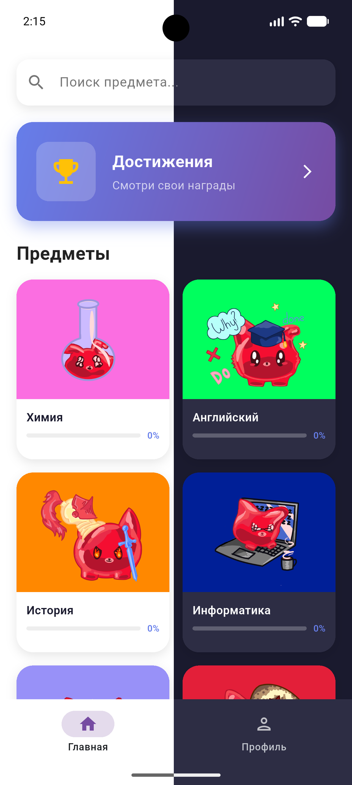
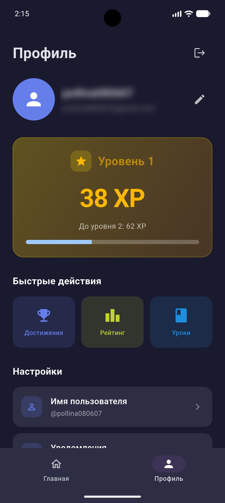

# 🎓 Qurio — Образовательная платформа нового поколения

> 🚀 **Учись с удовольствием**: интерактивные уроки, квизы, достижения и прогресс в одном приложении.

## ✨ Особенности

| 🎯 Фича | Описание |
|---------|----------|
| 📚 Уроки по предметам | Математика, физика, химия, английский, русский, история, информатика |
| 🧠 Интерактивные квизы | Проверка знаний с мгновенной обратной связью и подсчётом баллов |
| 🏆 Система достижений | Разблокируй бейджи за успехи: «Первый шаг», «Перфекционист», «Коллекционер XP» |
| ⚡ XP и уровни | Набирай опыт за правильные ответы, повышай уровень и отслеживай прогресс |
| 💬 Сохранение цитат | Выделяй важные абзацы и сохраняй их в персональную коллекцию |
| 🌓 Тёмная/светлая тема | Переключайся между темами — приложение подстроится под твои предпочтения |
| 🔍 Умный поиск | Мгновенно находи нужные предметы и уроки |
| 📊 Визуальный прогресс | Отслеживай заполнение прогресс-баров по каждому предмету |
| 🎨 Современный дизайн | Пастельные цвета, анимации наклона, адаптивная вёрстка |

## 📱 Скриншоты

| Главная | Профиль |
|---------|---------|
|  |  |

## 🛠️ Технологии

- **Frontend:** Flutter 3.11+, Provider, Clean Architecture
- **Backend:** Firebase Auth, Cloud Firestore, Firebase Security Rules
- **Пакеты:** `cloud_firestore`, `firebase_auth`, `provider`, `shared_preferences`, `share_plus`, `uuid`

